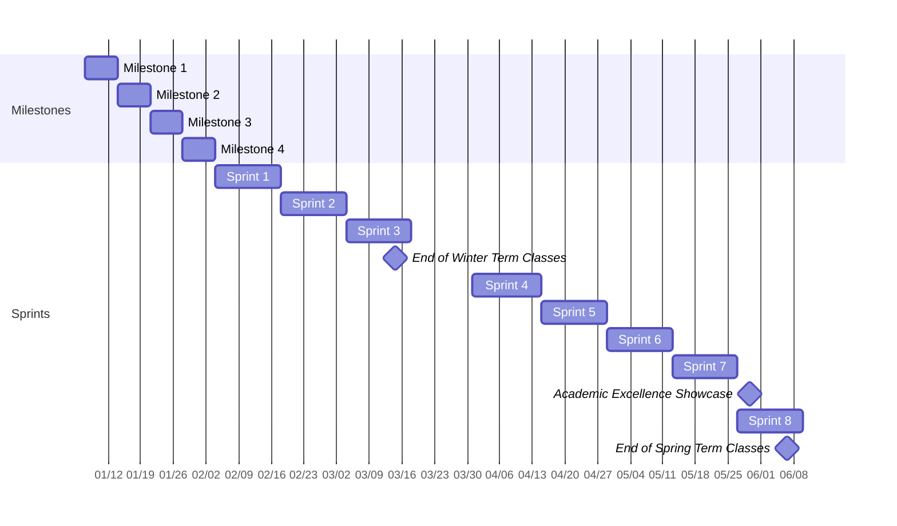

## Stork Dork Timeline & Release Plan

| Milestone   | Start Date          | End Date            | Description                                                                      |
| ----------- | ------------------- | ------------------- | -------------------------------------------------------------------------------- |
| Milestone 1 | January 8th, 2025   | January 14th, 2025  | Initial project setup and brainstorming                                          |
| Milestone 2 | January 15th, 2025  | January 21st, 2025  | Working on project ideas and user/system needs. Diagram drafts.                  |
| Milestone 3 | January 22nd, 2025  | January 28th, 2025  | Noting users/personas, refining needs/features, and setting up JIRA.             |
| Milestone 4 | January 29th, 2025  | February 4th, 2025  | Create PBI, plan Sprint 1, finalize architecture decisions and create data model |
| Sprint 1    | February 5th, 2025  | February 18th, 2025 | Sprint goal to be determined in planning meeting.                                |
| Sprint 2    | February 19th, 2025 | March 4th, 2025     | Sprint goal to be determined in planning meeting.                                |
| Sprint 3    | March 5th, 2025     | March 18th, 2025    | Sprint goal to be determined in planning meeting.                                |
| Break       | March 23, 2025      | March 29, 2025      | Term break and planning for the next phase.                                      |
| Sprint 4    | March 31st, 2025    | April 15th, 2025    | Sprint goal to be determined in planning meeting.                                |
| Sprint 5    | April 16th, 2025    | April 29th, 2025    | Sprint goal to be determined in planning meeting.                                |
| Sprint 6    | April 30th, 2025    | May 13th, 2025      | Sprint goal to be determined in planning meeting.                                |
| Sprint 7    | May 14th, 2025      | May 27th, 2025      | Sprint goal to be determined in planning meeting.                                |
| Sprint 8    | May 28th, 2025      | June 10th, 2025     | Bug-fix, documentation, maintenance. Presentation rehearsal and preparation.     |
| AES         | May 29, 2025        | May 29, 2025        | Presenting the birding web app at the Academic Excellence Showcase.              |

